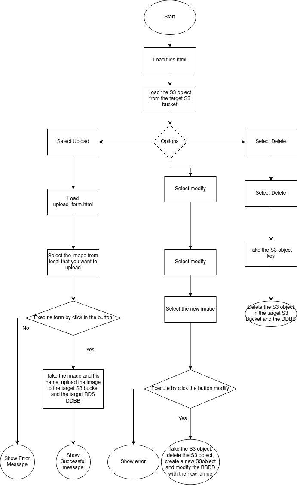

# AWS JAVA SPRING BOOT MAVEN WITH 

## DESCRIPTION


## Table of contents
- [Analysis](#analisys)
    * [Tecnologies](#tecnologies)
    * [Utilities](#utilities)
    * [Diagram](#Diagram)
- [Desing](#desing)
- [Credits](#credits)

## Analysis
### Tecnologies
This project require:
* Apache Maven 3.6.3.
* Java 17.
* Spring 3.0.1.
* AWS SDK Java v2.
* My SQL.
* XML.
* AWS.
  * S3.
  * VPC.
  * RDS.
* Enviroment variables.

### Utilities
1. The web should load the S3 object in the target S3 bucket and show them.
2. The web should upload images in the S3 bucket and the RDS with MY SQL.
3. The web should modify the S3 Object bucket and RDS table.
4. The web sould delete the S3 Object and RDS table.

### Diagram


## Design
### AppApplication
Run the application.
```java
{
    @SpringBootApplication
public class AppApplication {
	Environment env;
	public static void main(String[] args) {
		SpringApplication.run(AppApplication.class, args);

	}
}
```
### MainController
Coordinate the differents pages and his actions.
```java
{
    /**
 * Main controller
 */
@Controller
public class MainController {
    /**
     * Redirect to files
     * @return
     */
    @GetMapping("/")
    public String showIndex(){
        return "redirect:/files";
    }

    /**
     * Load uploadform
     * @param model the model
     * @return the html
     */
    @GetMapping("files/new")
    public String newFile(Model model){
        return "upload_form";
    }

    /**
     * Load the form action and redirect to the same html
     * @param model the model
     * @param image the image to upload
     * @return the html
     */
    @PostMapping("/files/upload")
    public String uploadFile(Model model, @RequestParam("file") MultipartFile image){
        String publicURL;
        try{
            publicURL = S3Util.uploadFile(image.getOriginalFilename(), image);
            model.addAttribute("message", "Upload sucessful: "+publicURL);
        } catch (RuntimeException e) {
            model.addAttribute("message","Upload unsuccesfull\n"+e.getMessage());
        } catch (Exception ex){

            model.addAttribute("message","Upload unsuccesfull\n"+ex.getMessage());
        }
        return "upload_form";
    }

    /**
     *  Load files
     * @param model the model
     * @return the html
     */
    @GetMapping("/files")
    public String getListFiles(Model model) {
        List<S3Object> s3Objects = S3Util.listFile();
        model.addAttribute("files", s3Objects);
        return "files";
    }

    /**
     * Load the action delete
     * @param fileKey the key to delete
     * @param model the model
     * @param redirectAttributes the redictAttributes
     * @return redirect to files
     */
    @GetMapping("/files/delete/{fileKey:.+}")
    public String deleteFile(@PathVariable String fileKey, Model model, RedirectAttributes redirectAttributes) {
        S3Util.deleteFile(fileKey);

        return "redirect:/files";
    }

    /**
     * Load the action form to modify a image
     * @param file the file
     * @param key the key
     * @return redirect to files
     */
    @PostMapping("/files")
    public String newFile( @RequestParam("file") MultipartFile file, @RequestParam("key") String key){
        S3Util.modifyFile(key, file);
        return "redirect:/files";
    }
}
```
### The htmls
#### Files

```html
{
<!DOCTYPE html>
<html xmlns:th="http://www.thymeleaf.org">

<head>
    <meta http-equiv="Content-Type" content="text/html; charset=UTF-8" />
    <meta name="viewport" content="width=device-width,initial-scale=1.0,minimum-scale=1.0" />
    <title>S3 list</title>
    <link rel="stylesheet" href="https://cdnjs.cloudflare.com/ajax/libs/font-awesome/6.2.0/css/all.min.css"
        integrity="sha512-xh6O/CkQoPOWDdYTDqeRdPCVd1SpvCA9XXcUnZS2FmJNp1coAFzvtCN9BmamE+4aHK8yyUHUSCcJHgXloTyT2A=="
        crossorigin="anonymous" referrerpolicy="no-referrer" />
</head>

<body>
    <div th:replace="fragments/header :: header"></div>

        <div class="container-fluid" style="max-width: 600px; margin: 0 auto;">
            <h2 class="text-center">List of Files</h2>

            <div th:if="${files.size() > 0}">
                <table class="table table-hover">
                    <thead class="thead-light">
                    <tr>
                        <th scope="col">File Name</th>
                        <th scope="col">Link</th>
                        <th scope="col">Actions</th>
                    </tr>
                    </thead>
                    <tbody>
                    <tr th:each="file : ${files}">
                        <form id="renameForm" th:action="@{/files}" method="post" enctype="multipart/form-data">
                            <td>
                                <input th:id="*{key}" th:value="${file.key}" name="key" readonly/>
                            </td>
                            <td>
                                <input type="file" id="*{image}" name="file" />
                            </td>
                            <td>
                                <button class="btn" type="submit" >Update Image</button>
                                <!--<a th:href="@{'/file/modify/' + $file.key}}" >Update Image</a>-->
                            </td>
                        </form>
                        <td>
                            <a th:href="@{'/files/delete/' + ${file.key}}" th:fileKey="${file.key}" id="btnDelete"
                            title="Delete this file" class="fa-regular fa-trash-can icon-dark btn-delete"></a>
                        </td>
                    </tr>
                    </tbody>
                </table>
            </div>

            <div th:unless="${files.size() > 0}">
                <span>No files found!</span>
            </div>
        </div>

    <div th:replace="fragments/footer :: footer"></div>

</body>

</html>
}
```
#### Upload_Form.html

```html
{
    <!DOCTYPE html>
<html xmlns:th="http://www.thymeleaf.org">

<head>
    <meta http-equiv="Content-Type" content="text/html; charset=UTF-8" />
    <meta name="viewport" content="width=device-width,initial-scale=1.0,minimum-scale=1.0" />
    <title>S3 practice</title>
</head>

<body>
<div th:replace="fragments/header :: header"></div>

        <div class="container" style="max-width: 500px">
            <h3 class="mb-3">Thymeleaf File Upload example</h3>

            <form
                    id="uploadForm"
                    method="post"
                    th:action="@{/files/upload}"
                    enctype="multipart/form-data">
                <input id="input-file" type="file" name="file" />
                <button class="btn btn-sm btn-outline-success float-right" type="submit">
                    Upload
                </button>
            </form>

            <div
                    th:if="${message != null}"
                    class="alert alert-secondary alert-dismissible fade show text-center message mt-3"
                    role="alert">
                [[${message}]]
                <button type="button" class="close btn-sm" data-dismiss="alert" aria-label="Close">
                    <span aria-hidden="true">×</span>
                </button>
            </div>
        </div>


<div th:replace="fragments/footer :: footer"></div>
</body>

</html>
}
```
#### Header.html
```html
{
<header th:fragment="header" xmlns:th="http://www.w3.org/1999/xhtml">
    <nav class="navbar navbar-expand-md bg-dark navbar-dark mb-3">
        <a class="navbar-brand" th:href="@{/files}">
            Malkien
        </a>
        <button class="navbar-toggler" type="button" data-toggle="collapse" data-target="#topNavbar">
            <span class="navbar-toggler-icon"></span>
        </button>
        <div class="collapse navbar-collapse" id="topNavbar">
            <ul class="navbar-nav">
                <li class="nav-item">
                    <a class="nav-link" th:href="@{/files/new}">Upload</a>
                </li>
                <li class="nav-item">
                    <a class="nav-link" th:href="@{/files}">Files</a>
                </li>
            </ul>
        </div>
    </nav>
</header>
}
```
#### Footer.html
```html
{
<footer class="text-center">
    Copyright © Malkien
</footer>
}
```
### Application.properties
```Bash
{
spring.servlet.multipart.max-file-size = 1000MB
spring.servlet.multipart.max-request-size = 1000MB

spring.output.ansi.enabled=always
logging.file.path=logs/
logging.file.name=logs/application.log

server.error.include-stacktrace = always
server.error.include-exception = true
server.error.include-message = always
server.error.whitelabel.enabled=false

bucket.name=${BUCKET_NAME}

RDS_INSTANCE_ID=${RDS_INSTANCE_ID}
RDS_INSTANCE_HOSTNAME=${RDS_INSTANCE_HOSTNAME}
RDS_DB_USER=${RDS_DB_USER}
RDS_PASSWORD=${RDS_PASSWORD}
RDS_DATABASE=${RDS_DATABASE}
RDS_INSTANCE_PORT=${RDS_INSTANCE_PORT}
RDS_REGION_NAME=${RDS_REGION_NAME}
RDS_JDBC_URL= jdbc:mysql://${RDS_INSTANCE_HOSTNAME}:${RDS_INSTANCE_PORT}/$DATABASE
}
```
### S3Utils
This Service handler the upload, delete, modify and get funtions, from S3 and call the RDSUtils to do the same in the BBDD.
```java
{
    @Service
@PropertySource("classpath:application.properties")
public class S3Util {
    /**
     * Contain the bucket name from Enviroment
     */
    private static String BUCKET_NAME;
    /**
     * CLIENT used to access the bucket
     */
    private static final S3Client s3= S3Client.builder().credentialsProvider(InstanceProfileCredentialsProvider.builder().build()).build();

    /**
     * Constructor that load the Bucket Name value
     * @param name
     */
    public S3Util(@Value("${bucket.name}") String name){
        BUCKET_NAME = name;
    }

    /**
     * Insert the iamge metadata in a database and upload the image to the bucket
     * @param key key od the object
     * @param file the image
     * @return MEssage String if all went ok
     * @throws RuntimeException
     */
    public static String uploadFile(String key, MultipartFile file) throws RuntimeException{
        try{

            RDSUtils.insertData(key, file.getInputStream());
            PutObjectRequest objectRequest = PutObjectRequest.builder()
                    .bucket(BUCKET_NAME)
                    .key(key)
                    .build();

            s3.putObject(objectRequest, RequestBody.fromInputStream(file.getInputStream(), file.getSize()));
            return "Image Upload";

        } catch (IOException e) {
            throw new RuntimeException(e);
        }
    }

    /**
     * delete the object in the bucket by the key is provided
     * @param key the key
     * @return is all ok true if error false
     */
    public static boolean deleteFile(String key){
        DeleteObjectRequest deleteObjectRequest = DeleteObjectRequest.builder()
                .bucket(BUCKET_NAME)
                .key(key)
                .build();

        s3.deleteObject(deleteObjectRequest);
        if(!RDSUtils.delete(key)){
            return false;
        }
        return true;
    }

    /**
     * Modify the image of the object by key (To do this you need to delete and create a new object in bucket because you can't modify an object when is upload)
     * @param key the key
     * @param file the new image
     * @return true if all  ok false if error
     */
    public static boolean modifyFile(String key, MultipartFile file){
        boolean delete = deleteFile(key);
        String upload = uploadFile(key, file);
        if(delete && !upload.isEmpty()){
            try {
                return RDSUtils.modify(key, file.getInputStream());
            } catch (IOException e) {
                throw new RuntimeException(e);
            }

        }else{
            return false;
        }
    }

    /**
     * Get a list of al the object in the bucket
     * @return the list of S3Objects
     */
    public static List<S3Object> listFile(){
        try{
            ListObjectsRequest listObjects = ListObjectsRequest
                    .builder()
                    .bucket(BUCKET_NAME)
                    .build();
            ListObjectsResponse res = s3.listObjects(listObjects);

            return res.contents();
        } catch (AwsServiceException e) {
            throw new RuntimeException(e);
        } catch (SdkClientException e) {
            throw new RuntimeException(e);
        }
    }
}
}
```
### RDSUtils

```java
{
@Service
public class RDSUtils {
    /**
     * Save the RDS instance ID
     */
    private static String dbInstanceIdentifier;
    /**
     * Save the region name
     */
    private static String REGION_NAME;
    /**
     * Save the RDS instance hostname
     */
    private static String RDS_INSTANCE_HOSTNAME;
    /**
     * Save the BBDD user
     */
    private static String DB_USER;
    /**
     * Save the DDBB name
     */
    private static String DATABASE;
    /**
     * Save the RDS instance port
     */
    private static int RDS_INSTANCE_PORT;
    /**
     * Save the DDBB password
     */
    private static String PASSWORD;
    /**
     * Save the jdbc url that connection need
     */
    private static String JDBC_URL;

    /**
     * load the variables values
     * @param id RDS isntance id
     * @param region RDS region
     * @param hostname RDS hostname
     * @param user DDBB user
     * @param pass DDBB password
     * @param database DDBB database name
     * @param port RDS port
     */
    public RDSUtils(@Value("${RDS_INSTANCE_ID}") String id,
                    @Value("${RDS_REGION_NAME}") String region,
                    @Value("${RDS_INSTANCE_HOSTNAME}") String hostname,
                    @Value("${RDS_DB_USER}") String user,
                    @Value("${RDS_PASSWORD}") String pass,
                    @Value("${RDS_DATABASE}") String database,
                    @Value("${RDS_INSTANCE_PORT}") int port) {
        dbInstanceIdentifier = id;
        REGION_NAME = region;
        RDS_INSTANCE_HOSTNAME = hostname;
        DB_USER = user;
        DATABASE = database;
        RDS_INSTANCE_PORT = port;
        PASSWORD = pass;
        JDBC_URL = "jdbc:mysql://" + RDS_INSTANCE_HOSTNAME + ":" + RDS_INSTANCE_PORT + "/" + DATABASE;
    }

    /**
     * This method returns a connection to the ddbb
     * @return the connection
     * @throws Exception
     */
    private static Connection getDBConnectionUsingIam() throws Exception {
        return DriverManager.getConnection(JDBC_URL,DB_USER,PASSWORD);
    }

    /**
     * Make an insert in the DDBB
     * @param key the key in String
     * @param file the file in InputStream
     */
    public static void insertData(String key, InputStream file){
        Connection connection = null;
        PreparedStatement prepareStatement = null;
        try {
            connection = getDBConnectionUsingIam();
            String sql = "INSERT INTO `"+DATABASE+"` VALUES (?,?)";
            prepareStatement = connection.prepareStatement(sql);
            prepareStatement.setString(1, key);
            prepareStatement.setBlob(2, file);
            prepareStatement.executeUpdate();

        } catch (SQLException e) {
            throw new RuntimeException(e);
        } catch (Exception e) {
            throw new RuntimeException(e);
        }
        finally {
            try {
                connection.close();
                prepareStatement.close();
            } catch (SQLException e) {
                throw new RuntimeException(e);
            }
        }
    }

    /**
     * Delete a DDBB row from the key
     * @param key the key
     * @return true if ok.
     */
    public static boolean delete(String key){

        Connection connection = null;
        PreparedStatement preparedStatement = null;
        try {
            connection = getDBConnectionUsingIam();
            String sql = "DELETE FROM `"+DATABASE+"` WHERE `key` = ?";
            preparedStatement = connection.prepareStatement(sql);
            preparedStatement.setString(1, key);
            preparedStatement.execute();
        } catch (Exception e) {
            throw new RuntimeException(e);
        }finally {
            try {
                connection.close();
                preparedStatement.close();
            } catch (SQLException e) {
                throw new RuntimeException(e);
            }
        }
        return true;
    }

    /**
     * Modify the DDBB row by param key
     * @param key the key
     * @param file the file
     * @return true ok false error
     */
    public static boolean modify(String key, InputStream file){
        Connection connection = null;
        PreparedStatement prepareStatement = null;
        try {
            connection = getDBConnectionUsingIam();
            String sql = "UPDATE `"+DATABASE+"` SET `metadata` = `?` WHERE `key` = `?`";
            prepareStatement = connection.prepareStatement(sql);
            prepareStatement.setBlob(1, file);
            prepareStatement.setString(2, key);
            prepareStatement.executeUpdate();

        } catch (SQLException e) {
            throw new RuntimeException(e);
        } catch (Exception e) {
            throw new RuntimeException(e);
        }
        finally {
            try {
                connection.close();
                prepareStatement.close();
            } catch (SQLException e) {
                throw new RuntimeException(e);
            }
        }
        return true;
    }
}
}
```
## Credits
Made by me Malkien^^